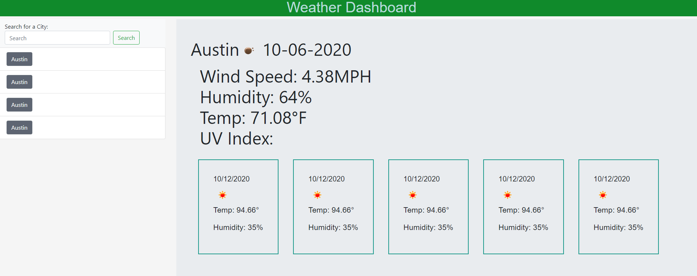

# Weather_Dashboard

## Description
As a Traveler you need to know the weather and forecast ourlook for multiple cities to plan and pack accordingly. With the [Wearher_Dashboard](https://zach-greenberg.github.io/Weather_Dashboard/), A user can search by city to gather weather details like Tempature, Wind speed, UV-Index, and a 5 day forecast. These searches will be tracked under the search button incase the user wants to refreash the weather information on the same city. The user will also know if the information is out of date or if they left the tab open since each search will be stamped with the date by the city name and Weather details.

If you would like to demo the Weather Dashboard for yourself please click ---> [Weather_Dashboard](https://zach-greenberg.github.io/Weather_Dashboard/)

## Table of Contents

* [What I Learned](#Learned)
* [Pictures and Link](#Img)

## Learned

This project called for api keys such as Openweather API and how to pull information from the JSON. I also practiced with local storage and reactive JavaScript since the user would input a city and from there a button was created within a list to show previously searched cities.

Languages used were JQuery, Openweathermap API, MomentJS library, and Bootstrap

## Img

